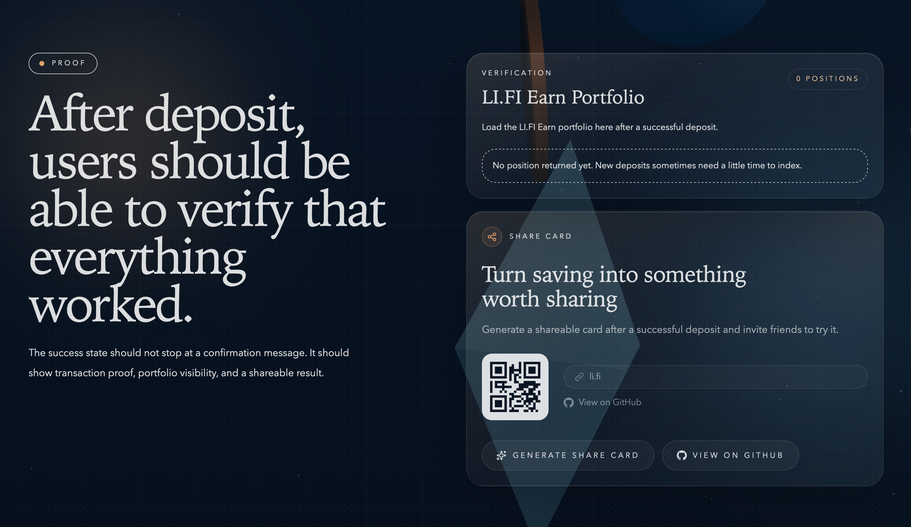

# Earn Gift 🎁

> **DeFi saving that feels like a form, not a dashboard.**

`Deposit your idle USDC into the earnings pool, as easy as depositing money in a bank - no need to understand DeFi, done in 30 seconds, and the money keeps growing every second.`

<div align="center">
  
  
  <br/>
  
  
</div>

**Live Demo Website:** [https://earn-gift-li-fi.vercel.app](https://earn-gift-li-fi.vercel.app)  
**Video Walkthrough:** [30-sec Demo](https://your-demo-link) <!-- Replace with actual link -->

---

## 🎯 The Problem

| Traditional DeFi | Friction Point |
|------------------|----------------|
| **10+ vaults** across chains | Decision paralysis |
| **Wrong chain** → failed deposit | Gas wasted, user lost |
| **"Connect → Approve → Deposit"** | 3 scary steps, 0 guidance |
| **No proof of earnings** | Trust gap after deposit |

**Result:** 90% of new users drop off before their first deposit.

---

## ✨ Our Solution

**One screen. One decision. Done.**

```
User picks duration (30/90/180d)
        ↓
We auto-select best Base vault (Aave/Morpho)
        ↓
User enters amount
        ↓
One-tap execute → Live verification
```

### What Makes It Different

| Feature | Impact |
|---------|--------|
| 🏦 **Base-first strategy** | Eliminates 70%+ wrong-chain errors |
| 📝 **Savings-form UX** | "Amount + Duration" instead of vault hunting |
| 🔍 **Real-time verification** | LI.FI portfolio API confirms deposit in seconds |
| 🎨 **Calm visual design** | Warm tones, no panic-red, no jargon |

---

## 🛠 Tech Stack


- **Frontend:** Next.js App Router + Tailwind + Framer Motion
- **Wallet:** RainbowKit (wagmi/viem)
- **DeFi APIs:** LI.FI Earn (vault discovery) + Composer (quotes & execution)
- **Verification:** LI.FI Portfolio API + on-chain event polling

---

## 🚀 Quick Start

```bash
pnpm install
pnpm dev
```

Open `http://localhost:3000`

---

## 📊 Hackathon Submission Highlights

### Innovation
- **Duration-first routing:** Simplified vault selection for non-technical users
- **Unified execution flow:** Quote → Approve → Deposit in one seamless flow
- **Post-deposit verification:** Real portfolio position confirmation via API

### Completion
- ✅ Live wallet connection
- ✅ Real vault discovery & quoting
- ✅ Approval + deposit execution
- ✅ Transaction scanning & verification
- ✅ Shareable deposit card generation

### Impact
- Base-prioritized strategy reduces demo friction
- Plain-language UX lowers DeFi entry barrier
- Built-in verification closes trust loop

---

## 👥 Team

DeFi UX specialists focused on making on-chain saving feel like banking.

---

## 🔮 Next Steps

- [ ] Batch approvals (reduce gas for repeat users)
- [ ] Risk indicators per vault
- [ ] Multi-chain expansion post-Base validation

---

*Built for the LI.FI DeFi UX Challenge*
